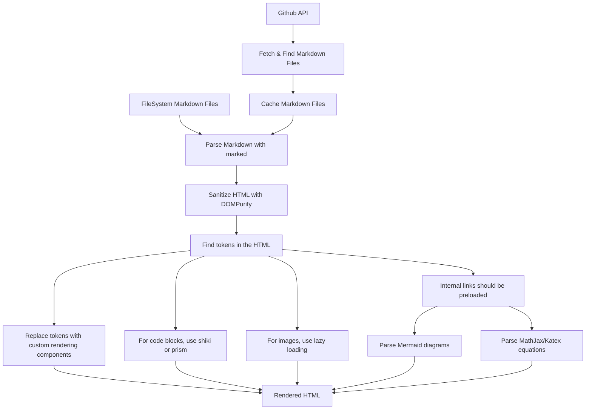

# Owais J's Blog

This is a blog built with SvelteKit's static site adapter and prerender
capabilities. It is deployed to Cloudflare Pages (tentatively) and uses
a content repository (filled with markdown files) hosted on Github.

## Tech Stack

- SvelteKit
- TailwindCSS
- Github API (Personal Access Token)

### Markdown Rendering Plan

## Features

| Feature | Category | Status | Notes |
| --- | --- | --- | --- |
| Two column with a sidebar | Layout | In Progress  |  |
| Post carousel | Layout | Planned |  |
| Responsive | Layout | Planned |  |
| Swappable reading font | Layout | Planned |  |
| Dark mode | Layout | Planned |  |
| Search | Functionality | Planned |  |
| Tags | Functionality | Planned |  |
| Pagination | Functionality | Planned |  |
| RSS feed | Functionality | Planned |  |
| Sitemap | Functionality | Planned |  |
| Github as a CMS | Functionality |  In Progress |  |
| Code highlighting | Functionality |  Planned |  |
| MathJax/Katex support | Functionality |  Planned |  |
| Mermaid diagrams | Functionality |  Planned |  |
| Image lazy loading | Functionality |  Planned |  |
| Internal link preloading | Functionality |  Planned |  |
| Markdown Token rendering components | Functionality |  Planned |  |
| (Tech Debt) Test suite | Quality, Documentation |  Planned |  |
| (Tech Debt) Linting | Quality |  Planned |  |
| (Tech Debt) Accessibility | Quality |  Planned |  |
| (Tech Debt) Storybook | Documentation |  Planned |  |
| SEO | Quality |  Planned |  |

## Design System

### Typography

- Heading: `Josefin Sans`
- Text: `Lato`
- Mono: `Overpass Mono`

### Icons

- [Remix Icon](https://remixicon.com/)

## Links

The *biggest* source of inspiration for this blog under the hood is an article
Kent C. Dodds wrote about how he built his blog. It is a great read and I highly
recommend it.

Check it out [here](https://kentcdodds.com/blog/how-i-built-a-modern-website-in-2021).

### Font Pairings

Link Format: `Heading Font` & `Text Font`

- [Epilogue Bold & Regular](https://www.fontpair.co/pairings/epilogue-bold-regular)
- [Montserrat & Open Sans](https://www.fontpair.co/pairings/montserrat-open-sans)
- [Montserrat & Hind](https://www.fontpair.co/pairings/montserrat-hind) ⭐️
- [Source Sans Pro & Source Serif Pro](https://www.fontpair.co/pairings/source-sans-pro-source-serif-pro) 🟩
    - I like the serif font in this one
- [Josefin Sans & Inter](https://www.fontpair.co/pairings/josefin-sans-inter) 🟩
    - I like the heading font
- [Cabin Bold & Regular](https://www.fontpair.co/pairings/cabin-bold-cabin-regular)
- [Montserrat & Source Sans Pro](https://www.fontpair.co/pairings/montserrat-source-sans-pro)
- [Forum & Work Sans](https://www.fontpair.co/pairings/forum-work-sans)
    - The heading font looks very professional.
- [Montserrat & Lato](https://www.fontpair.co/pairings/montserrat-lato)
    - Text font is easy to read.

### Inspiration

- [Maktub Theme](https://themeforest.net/item/maktub-minimal-lightweight-blog-for-wordpress/38348402)
- [Groovy Theme](https://themeforest.net/item/groovy-modern-lightweight-blog-for-wordpress/42876785)
- [Neobrutalism Docs](https://www.neobrutalism.dev/docs/)
- [Hugo Digital Garden Theme](https://github.com/apvarun/digital-garden-hugo-theme)

### Resources

- [Carbon Design System](https://www.carbondesignsystem.com/)
- [Carbon Snippets](https://carbon.now.sh/)
- [Font Pair](https://www.fontpair.co/)
